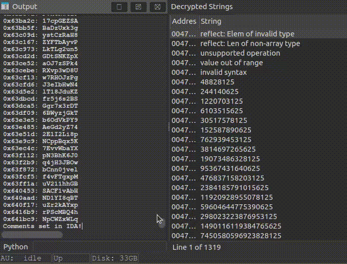

# ungarble_ida
IDA 9.0 plugin for decrypting strings encrypted by garble.

## Description:
This plugin attempts to decrypt strings encrypted by the Garble Obfuscator's literal obfuscation (https://github.com/burrowers/garble). It primarily targets the latest hardened literals obfuscation (see: https://github.com/burrowers/garble/commit/d47e0761eb51dedbce86a4f142ab45154f46adb1).
cpeter's project was a great help in understanding the different types of literal obfuscation:
https://cloud.google.com/blog/topics/threat-intelligence/gostringungarbler-deobfuscating-strings-in-garbled-binaries/.

The plugin has been tested on Windows and Linux binaries (x86 and x64), and it was able to recover all the strings from the binaries.
When you run the script, some errors are expected due to false positives, these can be safely ignored. The script is able to recover all the strings for a large binary in under a minute.

There may still be bugs, as this is very experimental.
Patching the decrypted strings is not yet implemented, but it will be soon.
Usage : File -> Script file... -> Select this script.

